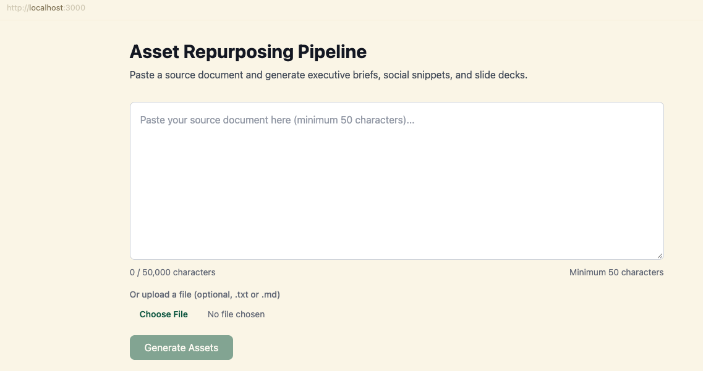
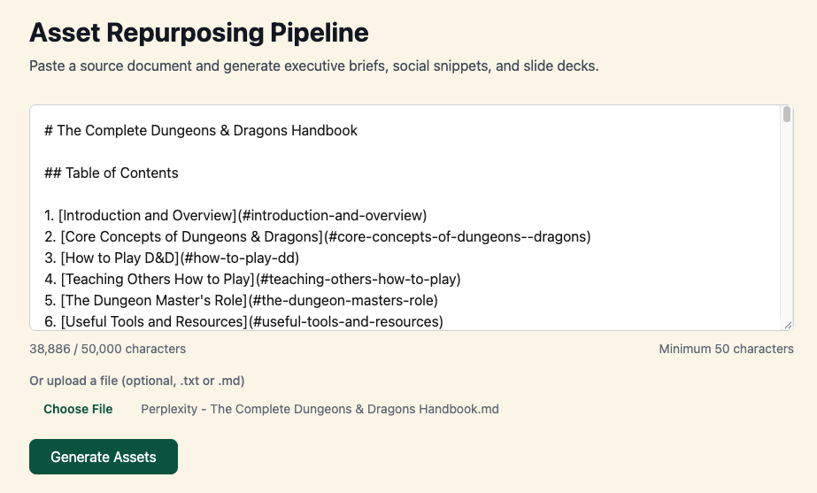
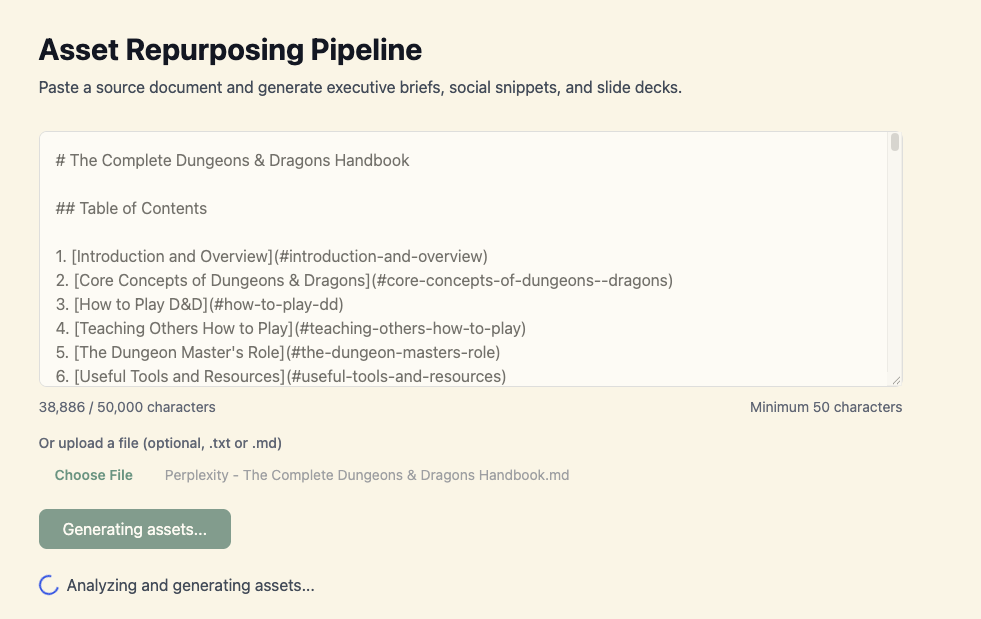
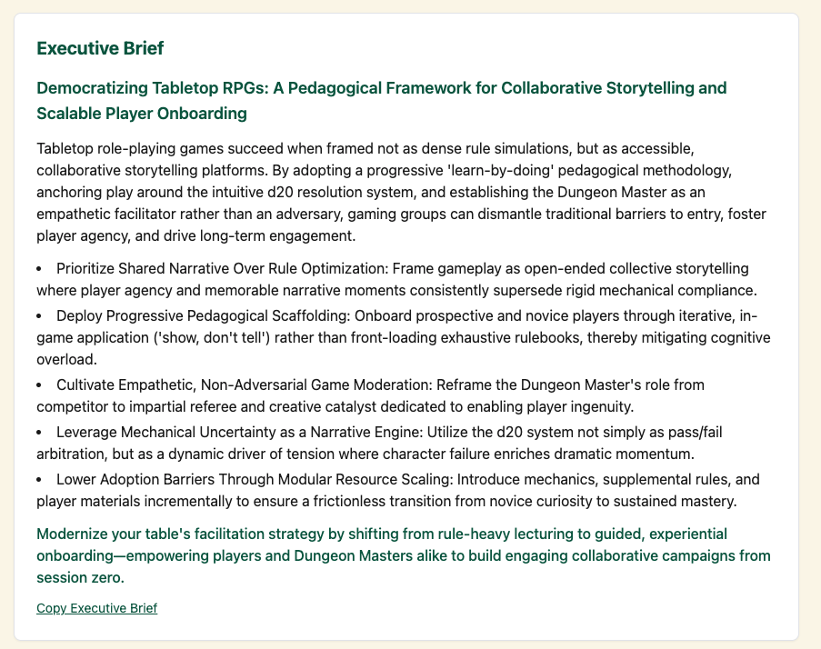
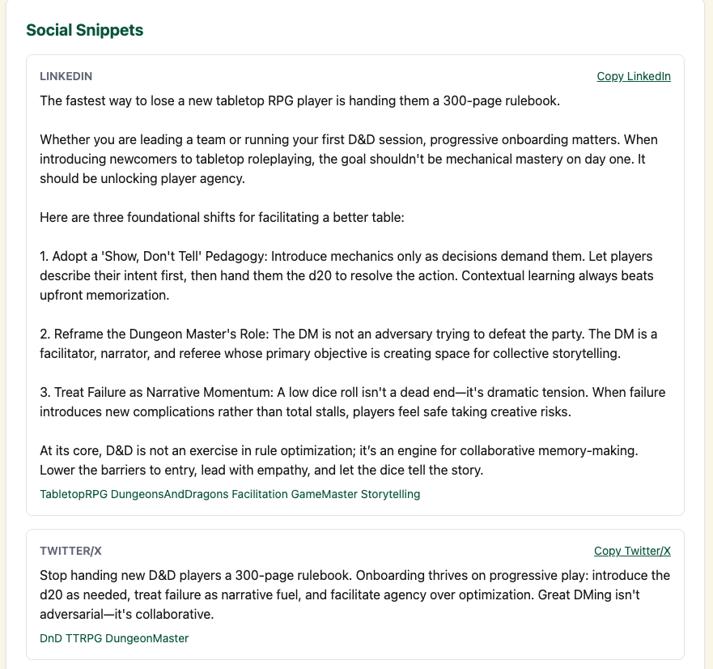
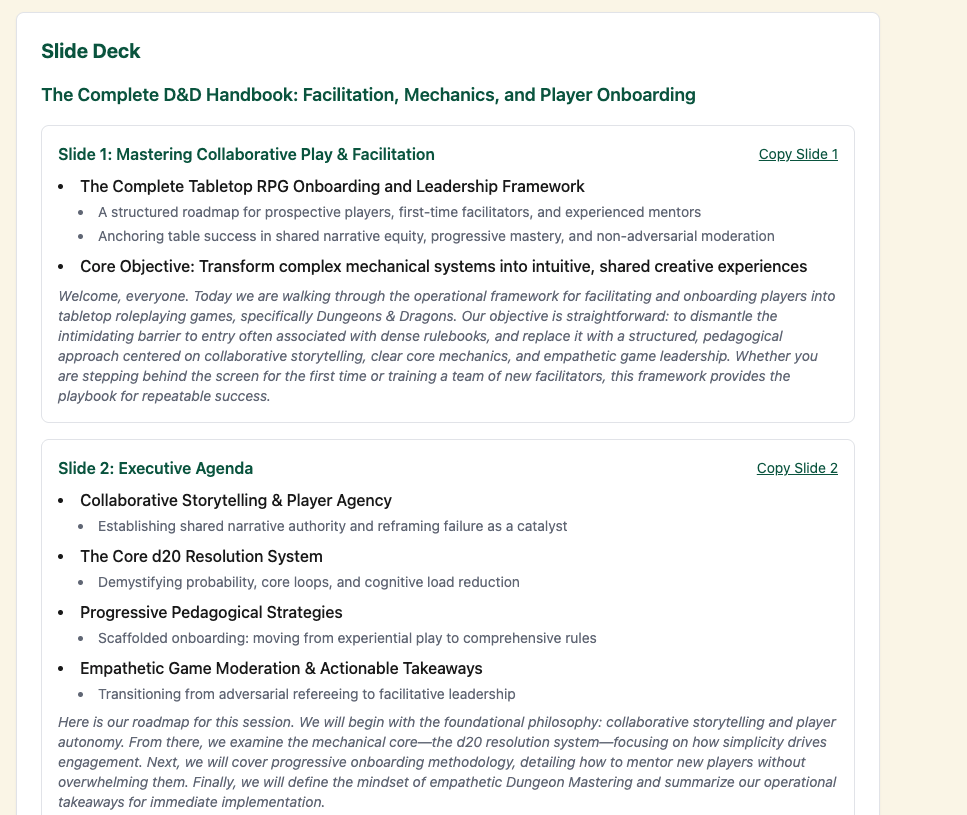

# Asset Repurposing Pipeline


An automated, schema-enforced DAG pipeline that ingests a single canonical source document and decomposes it into parallel derivative assets — an executive brief, platform-specific social snippets, and a slide deck — while preserving brand voice, tone, and factual alignment. Built as a production-oriented portfolio piece demonstrating structured LLM output, async orchestration, and containerized deployment.

## Stack

| Layer | Technology | Purpose |
|-------|------------|---------|
| Backend | Python 3.12, FastAPI, Pydantic | Schema validation, LLM orchestration, API surface |
| Frontend | Next.js 16 (App Router), TypeScript, Tailwind CSS | Dashboard for uploading source text and viewing assets |
| Orchestration | Native Python `asyncio` | Parallel, non-blocking generation nodes |
| LLM Provider | EdenAI OpenAI-compatible API | `https://api.edenai.run/v3` |
| Default Model | `google/gemini-3.8-flash` | Fast, cost-efficient structured generation |
| Deployment | Docker + Docker Compose (local), Cloud Run-ready | Containerized backend and frontend |

> **Frontend pinned to Next.js 16.3.4 (App Router) via `docs/decisions/2026-09-07-frontend-dependency-versions.md` to satisfy `npm audit` while staying within the "Next.js 14+" constraint and remaining React 18-compatible.**

## Architecture

```text
┌─────────────────────────────────────────────────────────────────────┐
│                         Asset Repurposing Pipeline                  │
└─────────────────────────────────────────────────────────────────────┘

  ┌──────────────┐
  │  Ingestion   │  POST /pipeline  { source_text }
  │   (FastAPI)  │
  └──────┬───────┘
         │
         ▼
  ┌──────────────────────────────────┐
  │     Extraction Node (fail-fast)   │  Extract Core Context
  │  themes | tone | audience | args  │  (title, themes, tone, audience,
  └──────────────┬───────────────────┘   primary_arguments, truncated)
                 │
                 ▼
  ┌──────────────────────────────────────────────────────────────┐
  │              Parallel Generation Nodes (asyncio.gather)        │
  │  ┌──────────────┐ ┌──────────────┐ ┌──────────────┐            │
  │  │ Executive    │ │ Social       │ │ Slide Deck   │            │
  │  │ Brief        │ │ Snippets     │ │ Generator    │            │
  │  └──────┬───────┘ └──────┬───────┘ └──────┬───────┘            │
  └─────────┼────────────────┼────────────────┼──────────────────┘
            │                │                │
            ▼                ▼                ▼
  ┌──────────────────────────────────────────────────────────────┐
  │              Aggregation Node (Pydantic validation)            │
  │  PipelineOutput { core_context, executive_brief,              │
  │                   social_snippets, slide_deck, errors }        │
  └──────────────────────────────────────────────────────────────┘

Frontend: Browser → Next.js /api/pipeline Route Handler → Backend /pipeline
                 (BACKEND_URL is server-only; never exposed to browser)
```

The pipeline is strictly unidirectional. The extraction node is **fail-fast** because every downstream generator depends on the core context. The three generators are **best-effort**: they run concurrently, and if one fails the others still return assets with the failure recorded in `errors`.

## Project Structure

```text
asset-repurposing/
├── backend/          # FastAPI service
│   ├── api/routes.py
│   ├── core/config.py
│   ├── core/schemas.py
│   ├── pipeline/
│   │   ├── dag.py
│   │   ├── extractors.py
│   │   ├── generators.py
│   │   ├── llm_client.py
│   │   └── utils.py
│   └── tests/
├── frontend/         # Next.js dashboard
│   ├── app/
│   │   ├── api/pipeline/route.ts   # server-side proxy
│   │   ├── components/
│   │   ├── page.tsx
│   │   └── layout.tsx
│   ├── lib/api.ts
│   └── lib/types.ts
├── docs/             # Planning docs and architecture decisions
│   ├── plan.md
│   ├── running-doc.md
│   └── decisions/
├── docker-compose.yml
└── README.md
```

## Quick Start

### 1. Clone and configure

```bash
cp backend/.env.example backend/.env
cp frontend/.env.example frontend/.env.local
# Edit backend/.env and add your EDENAI_API_KEY
# Edit frontend/.env.local if your backend is not on http://localhost:8000
```

### 2. Run with Docker Compose

```bash
docker-compose up --build
```

- Backend: http://localhost:8000
- Frontend: http://localhost:3000
- API docs: http://localhost:8000/docs

Inside Docker Compose, the frontend uses the internal service name to reach the backend (`BACKEND_URL=http://backend:8000`). The frontend browser never sees this URL.

### 3. Run backend locally (dev)

```bash
cd backend
python -m venv .venv
source .venv/bin/activate
pip install -r requirements.txt
uvicorn main:app --reload
```

### 4. Run frontend locally (dev)

```bash
cd frontend
npm install
npm run dev
```

The frontend proxies pipeline requests to the backend through a Next.js Route Handler at `frontend/app/api/pipeline/route.ts`. Set `BACKEND_URL=http://localhost:8000` in `frontend/.env.local` when running outside Docker.

## Live Demo

> **Live demo source:** The screenshots below show a real end-to-end run against [`assets-for-repurposing/Perplexity - The Complete Dungeons & Dragons Handbook.md`](assets-for-repurposing/Perplexity%20-%20The%20Complete%20Dungeons%20%26%20Dragons%20Handbook.md). The document is ≈38,900 characters, so it fits cleanly under the `MAX_SOURCE_CHARS=50000` default without truncation.

### 1. Home screen



### 2. Source input



### 3. Generating assets



### 4. Executive brief



### 5. Social snippets



### 6. Slide deck with tiered bullets and speaker notes



## Usage

Upload or paste source text into the frontend dashboard, or call the backend directly:

```bash
curl -X POST http://localhost:8000/pipeline \
  -H "Content-Type: application/json" \
  -d '{"source_text": "Your long source document here..."}'
```

## Environment Variables

### Backend

| Variable | Default | Description |
|----------|---------|-------------|
| `EDENAI_API_KEY` | — | Your EdenAI API key |
| `EDENAI_BASE_URL` | `https://api.edenai.run/v3` | EdenAI OpenAI-compatible base URL |
| `EDENAI_MODEL` | `google/gemini-3.8-flash` | Default chat model |
| `MAX_SOURCE_CHARS` | `50000` | Maximum source characters sent to the extraction prompt |
| `CORS_ORIGINS` | `http://localhost:3000` | Comma-separated list of origins allowed by the backend CORS middleware |

### Frontend

| Variable | Default | Description |
|----------|---------|-------------|
| `BACKEND_URL` | `http://localhost:8000` (non-Docker) / `http://backend:8000` (Docker) | Server-only URL for the FastAPI backend. Resolved by the Next.js Route Handler; never exposed to the browser. |

> **Proxy pattern note:** The frontend does not call the backend directly from the browser. Instead, the browser posts to `/api/pipeline`, and a Next.js server route forwards the request to `BACKEND_URL`. This makes the backend addressable via internal Docker networking and keeps deployment topology out of the client bundle.

## Frontend Build

```bash
cd frontend
npm install
npm run build
npm start
```

## Architecture Decisions

Key design choices are recorded in `docs/decisions/`:

- [`docs/decisions/2026-09-07-frontend-proxy-route.md`](docs/decisions/2026-09-07-frontend-proxy-route.md) — Why the frontend proxies backend calls via a Route Handler.
- [`docs/decisions/2026-09-07-frontend-dependency-versions.md`](docs/decisions/2026-09-07-frontend-dependency-versions.md) — Why Next.js 16.3.4 was chosen.
- [`docs/decisions/2026-09-07-python-version.md`](docs/decisions/2026-09-07-python-version.md) — Why Python 3.12 is the Docker runtime.
- [`docs/decisions/2026-09-07-error-handling-pattern.md`](docs/decisions/2026-09-07-error-handling-pattern.md) — Partial results with error flags for generator failures.

## Known Limits & Next Steps

- **Cloud Run deployment:** The Docker Compose setup is verified locally. The next step is to push the backend and frontend containers to Google Artifact Registry and deploy to Cloud Run with the same `BACKEND_URL` plumbing.
- **Frontend tests:** No Jest or Playwright suite is included yet. The happy-path and error-state UI branches are tested manually.
- **Retry-specific tests:** The backend uses `tenacity` for LLM retries, but unit tests covering fail-then-succeed retry paths are not yet written.
- **Authentication:** Out of scope for this MVP; the pipeline is deterministic and stateless.
- **Longer documents:** Sources beyond `MAX_SOURCE_CHARS` are truncated before extraction. Future work could chunk and merge very large documents.

## License

MIT
